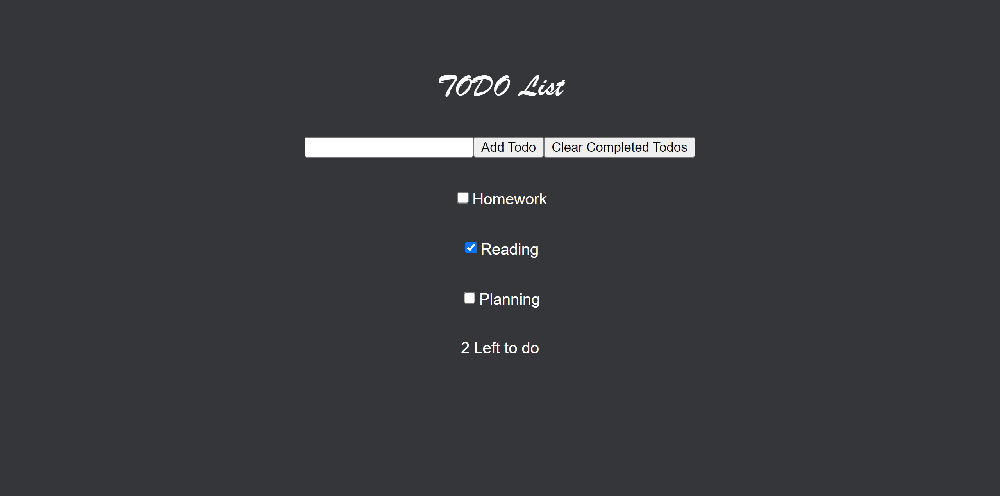

# Todo App React

This project was bootstrapped with [Create React App](https://github.com/facebook/create-react-app).

## Purpose

Todo App that tracks certain tasks in a Bulletin \
style list. 

### `npm start`

Runs the app in the development mode.\
Open [http://localhost:3000](http://localhost:3000) to view it in your browser.

### `Add Todo`

Type in text box then press this button to add another \
Todo Item.

### `Clear Completed Todos`

Removes all Todos from list that are checked.

## Demo

